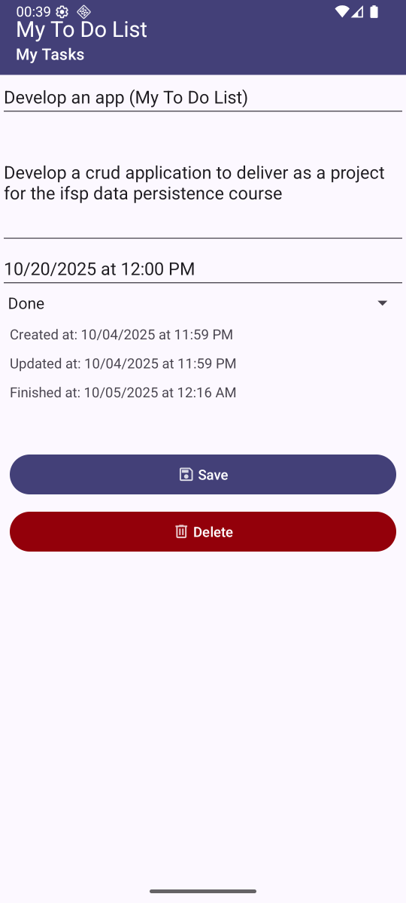

# My To Do List

## Objetivo

O objetivo do projeto compreende o desenvolvimento de um aplicativo para explorar os conceitos aprendidos na disciplina de Persistência de Dados do curso de Pós-Graduação Lato Sensu em Desenvolvimento de Sistemas para Dispositivos Móveis do Instituto Federal de São Paulo Campus São Carlos. O aplicativo desenvolve a definição de persistência de dados em dispositivos móveis a partir de implementações do SQLite e Room.

## Introdução

O aplicativo representa uma lista de tarefas que permite o gerenciamento de atividades a partir de operações de criação, visualização, alteração e exclusão. Com o aplicativo, o usuário consegue visualizar as tarefas que ele precisa realizar, assim como acompanhar o seu estado (pendente, em progresso ou finalizado) e o seu tempo máximo de conclusão (deadline). 

## Características

### Temas

O aplicativo possui tema claro e escuro, de maneira que o tema do aplicativo é adaptativo e se adequa ao definido no sistema.

### Cadastro de tarefas

É possível criar em uma tarefa clicando no botão flutuante. Ao clicar no botão, o usuário sera redirecionado para uma tela para cadastrar uma nova tarefa. Nessa tela é possível definir nome, descrição, tempo máximo para entrega e estado da tarefa. 

### Visualização das tarefas

As tarefas são visualizadas em forma de lista junto com o resumo de algumas informações, tais como, nome, tempo máximo para entrega (deadline) e estado.

### Finalização de uma tarefa

Na lista de tarefas, cada item possui um campo de seleção (checkbox) que permite marcar a tarefa como concluída ou pendente. Ao marcar essa campo de seleção, os textos da atividade são riscados, indicando que a atividade esta concluída.

### Visualização, edição e exclusão de uma tarefa

Ao clicar sobre uma tarefa, o usuário é redirecionado para a tela de edição. Nessa tela, é possível visualizar alguns dados, como horário de criação, alteração e finalização da tarefa. Além de editar os dados da tarefa, também é possível excluir uma atividade, clicando no botão disponível a baixo do botão de salvar.

### Exclusão de uma tarefa pelo menu de contexto

Ao clicar e segurar sobre uma tarefa, um menu de contexto aparece com a opção de excluir. 

### Persistência do último estado

Ao desmarcar o campo de seleção (checkbox) que conclui uma tarefa, nota-se que o último estado é preservado.

### Tarefas atrasadas

Quando uma tarefa foi concluida depois da deadline ou se ja passou o tempo dela ser entregue a tarefa e ela ainda não foi concluida, essa atividade é sinalizada com os textos em vermelho. 

### Persistência de dados

## Trabalhos futuros

Futuramente, seria interessante implementar filtros de buscas e de ordenação.